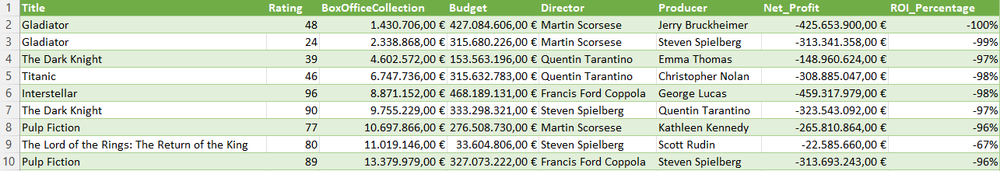
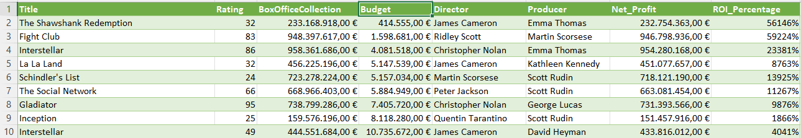
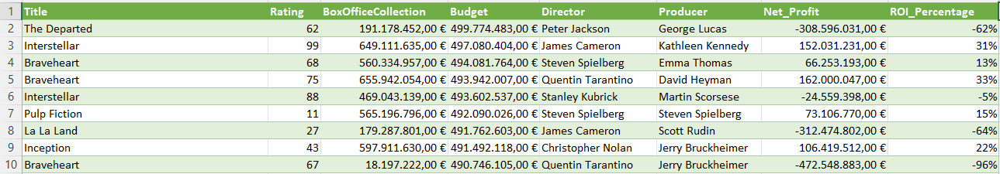
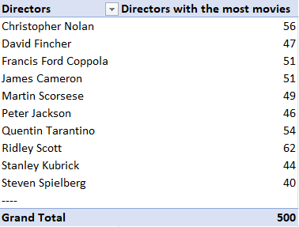
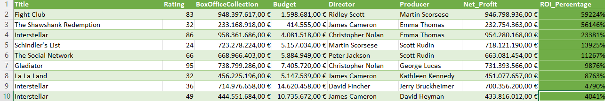

## Project Statement
1. Top 10 movies which have the highest income and which have the lowest.
2. Top 10 movies which have the highest budget and which have the lowest.
3. Which directors have directed the most movies? (we are going to limit the results to Top  10)
4. Which movie has the best income-budget ratio? Here we are gonna calculate the ROI(Return on Investment), find the highest ROI value in the list, and lastly find the movie name associated with the highest ROI value.

## 1. Top 10 movies which have the highest income and which have the lowest.
Lowest:

highest:

## 2. Top 10 movies which have the highest budget and which have the lowest.
Lowest: 

Highest:

## 3. Which directors have directed the most movies? (we are going to limit the results to Top  10)
Directors:

## 4. Which movie has the best income-budget ratio? Here we are gonna calculate the ROI(Return on Investment), find the highest ROI value in the list, and lastly find the movie name associated with the highest ROI value.
ROI

